--------------- 
# 2016

# 梦想家智能相框

梦想家将你闲置的iPad变成智能相框。展示家庭照片、旅行足迹，向家人留言，帮助孩子学习。让闲置的设备变成家庭中心，让你随时随地感受家庭的温暖。

相关技术：iPad, iPhone, android, LBS, Socket, Ruby, Sinatra 

[iPad 家庭端APP](https://itunes.apple.com/zh/app/meng-xiang-jia-shou-ji-ke/id1088730576?mt=8)

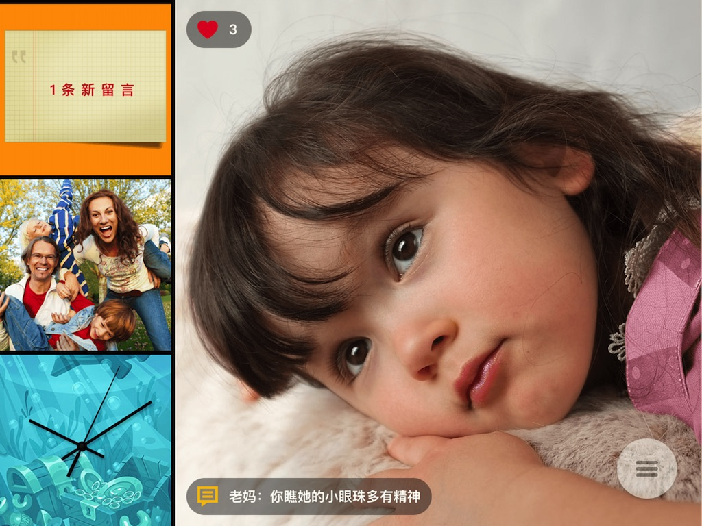

[iPhone 移动端APP](https://itunes.apple.com/zh/app/meng-xiang-jia-shou-ji-ke/id1088730576?mt=8)

# 云西游智能自行车

云西游时领先的互联网智能自行车。集成Smart超大功率助力电机、360智能灯光系统、全反馈式振动车把、轻触转向刹把等全球领先的智能自行车技术。

配合APP可全程提供场景化智能动力系统、精准数据智能分析、GPS导航、路线纪录分享、路书分享、骑友发现体验式社交、GPS防盗等功能。

相关技术：iPhone, android, BLE, LBS, PHP, Rails

[产品主页](http://z.jd.com/project/details/51020.html)

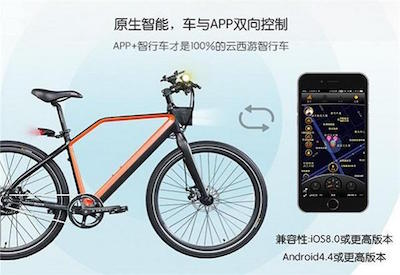

# 太阳能智能电站监控

相关技术：iPhone, swift

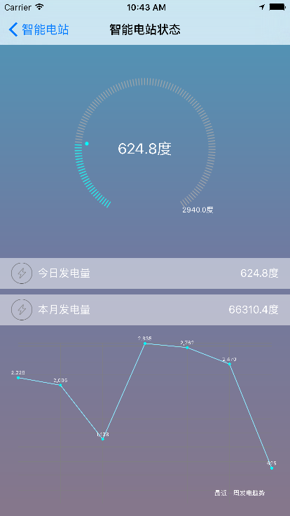

-----------------------
# 2015

# 台台台台

工作桌面摆设展示分享

相关技术：android, iPhone, 动画

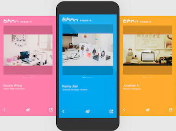

# 臭屁猪

Apple Watch健身小游戏

相关技术：Apple watch, HealthKit, swift

# goofy

儿童网络聊天智能玩具

相关技术：Arduino, ESP8266, VS1003, iPhone, android, Socket, Elixir

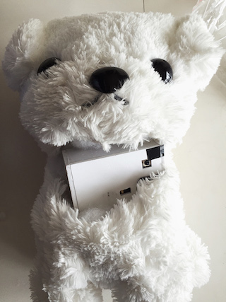

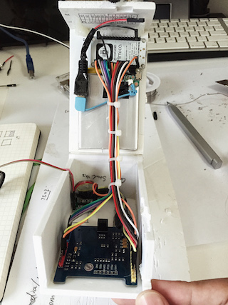

# freddy

iPhone推送通知灯玩具

相关技术：BLE，iPhone

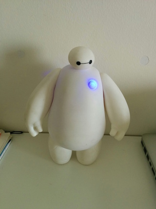

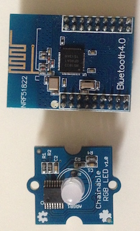

# 五彩智能LED相框

蓝牙连接调光

相关技术：Arduino, BLE

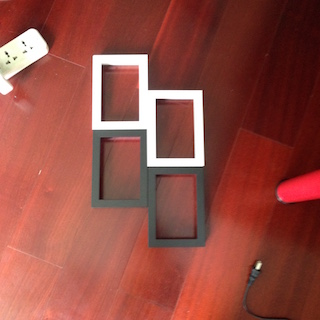

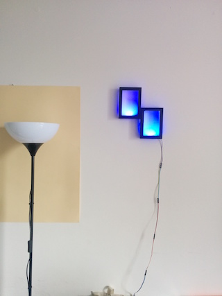

# 医家人

医生职业SNS

相关技术：android

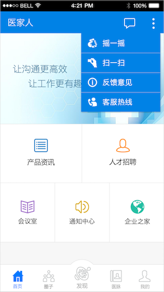

-----------------------
# 2013/2014

# 圈圈

LBS群组聊天社交APP

相关技术：iPhone, android, PHP, LBS, IM

# 移客

LBS聚会社交分享APP

相关技术：iPhone, android, PHP, LBS

# HiTaxi

东南亚出租车呼叫管理

相关技术：iPad, iPhone, swift, LBS

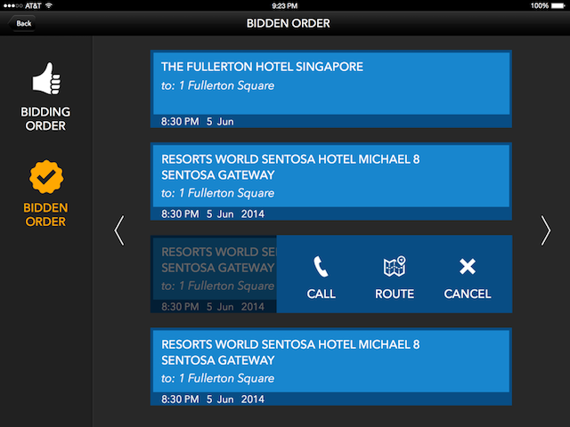

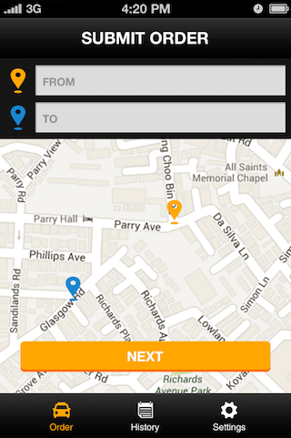

-----------------------
# 2012

# 博众资讯 - 视觉版新浪微博iPad客户端

一个专注于用户体验创新的微博阅读分享工具，将中国最cool的资讯用最cool的方式呈现给用户。

[app store](https://itunes.apple.com/cn/app/bo-zhong-zi-xun-shi-jue-ban/id504781130)

# 80A&D

设计师作品展示

[app store](https://itunes.apple.com/us/app/80-a-d/id457856749?mt=8)

# 七彩语文电子杂志

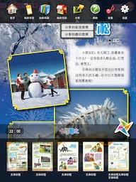

# abook

阿拉伯文版ibooks电子书库

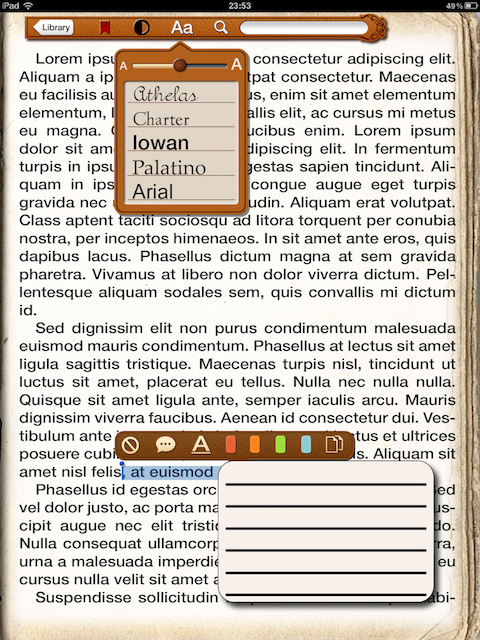

# EasyBranding

传世国际品牌及项目管理APP

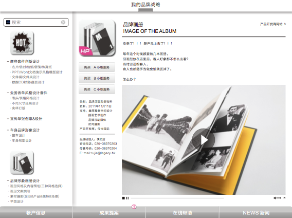

# LaundryPack

宝洁洗衣粉卖场展示APP

# HofBar

酒吧连锁体验APP

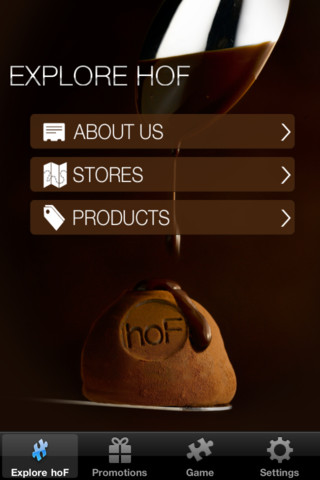

# TAG Heuer Carrera 1887

豪雅产品展示APP

# 博众财经

股市资讯SNS

-----------------------
# 2010/2011

# 博众资讯

中文社交杂志APP

[app store](https://itunes.apple.com/us/app/bo-zhong-zi-xun/id398942817?mt=8)

# TagHeuer

品牌及门店3D虚拟体验A

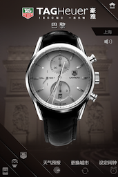

# iDeco

家居装潢iPad电子杂志

# iDesign

产品设计iPad电子杂志

# uNote

android平台上的简单的记事工具，设计着眼于用最少的用户输入完成记事任务

[play store](https://market.android.com/details?id=com.ohglaube.unote)

# uRead

android平台上的简单易用的RSS阅读工具，采用最少页面切换原则设计，为用户提供流畅的阅读体验

[play store](https://market.android.com/details?id=com.ohglaube.uread)

